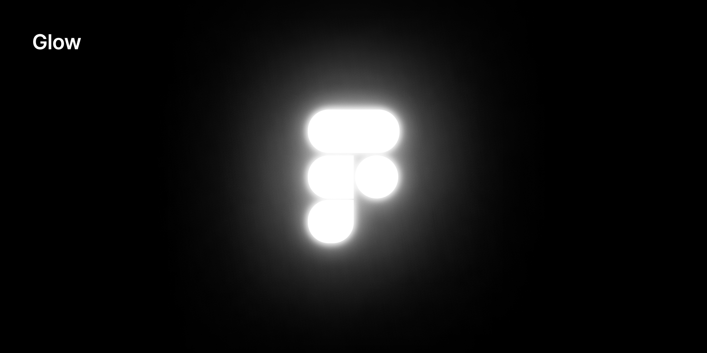

Adds a smooth glow which mimics the [inverse square falloff](https://en.wikipedia.org/wiki/Inverse-square_law) of a physical light source.

The glow effect is achieved by layering and easing multiple drop-shadows.

By default, the plugin brightens the fill layer to match the corresponding glow color and intensity. This behavior can be disabled in the settings.

## 🌀 Misc

This plugin uses the amazing [create-figma-plugin](https://github.com/yuanqing/create-figma-plugin) library.

## 📝 License

[MIT](LICENSE)
